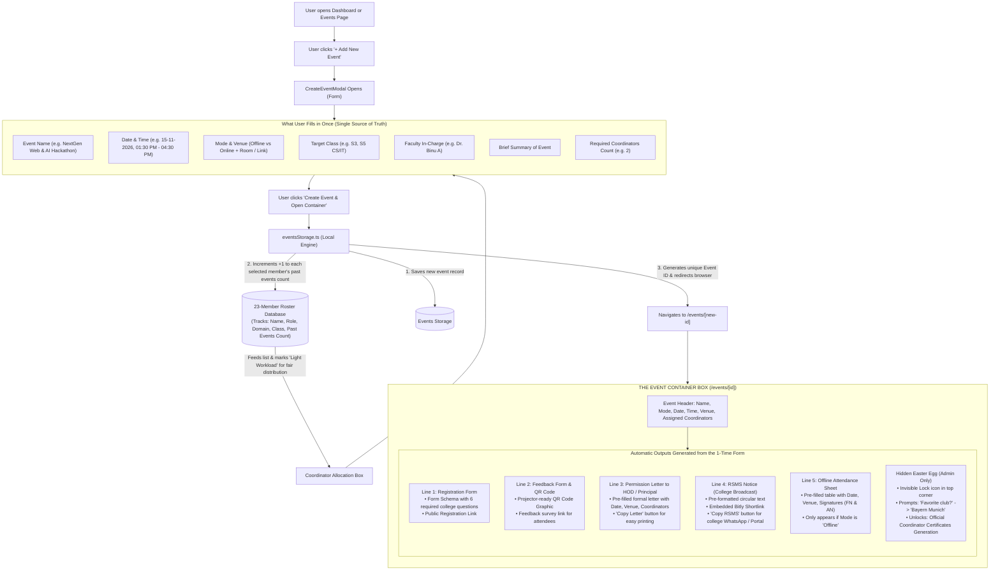

# Detailed Data Flow & User Journey

```mermaid
flowchart TD
    %% Step 1: User Entry
    Start["User opens Dashboard or Events Page"] --> ClickBtn["User clicks '+ Add New Event'"]
    
    %% Step 2: The Modal
    ClickBtn --> Modal["CreateEventModal Opens (Form)"]

    %% External Data Feeding In
    MembersDB[("23-Member Roster Database<br/>(Tracks: Name, Role, Domain, Class, Past Events Count)")] 
    MembersDB -->|Feeds list & marks 'Light Workload' for fair distribution| CoordBox["Coordinator Allocation Box"]

    subgraph UserInputs["What User Fills in Once (Single Source of Truth)"]
        direction TB
        F1["Event Name (e.g. NextGen Web & AI Hackathon)"]
        F2["Date & Time (e.g. 15-11-2026, 01:30 PM - 04:30 PM)"]
        F3["Mode & Venue (Offline vs Online + Room / Link)"]
        F4["Target Class (e.g. S3, S5 CS/IT)"]
        F5["Faculty In-Charge (e.g. Dr. Binu A)"]
        F6["Brief Summary of Event"]
        F7["Required Coordinators Count (e.g. 2)"]
    end

    Modal --> UserInputs
    CoordBox --> UserInputs

    %% Step 3: Saving and Routing
    UserInputs --> SaveBtn["User clicks 'Create Event & Open Container'"]
    SaveBtn --> StorageEngine["eventsStorage.ts (Local Engine)"]
    StorageEngine -->|1. Saves new event record| StoredEvents[("Events Storage")]
    StorageEngine -->|2. Increments +1 to each selected member's past events count| MembersDB
    StorageEngine -->|3. Generates unique Event ID & redirects browser| Router["Navigates to /events/[new-id]"]

    %% Step 4: The Event Container Box
    Router --> EventBox

    subgraph EventBox["THE EVENT CONTAINER BOX (/events/[id])"]
        direction TB
        Header["Event Header: Name, Mode, Date, Time, Venue, Assigned Coordinators"]

        subgraph Outputs["Automatic Outputs Generated from the 1-Time Form"]
            direction TB
            
            L1["Line 1: Registration Form<br/>• Form Schema with 6 required college questions<br/>• Public Registration Link"]
            
            L2["Line 2: Feedback Form & QR Code<br/>• Projector-ready QR Code Graphic<br/>• Feedback survey link for attendees"]
            
            L3["Line 3: Permission Letter to HOD / Principal<br/>• Pre-filled formal letter with Date, Venue, Coordinators<br/>• 'Copy Letter' button for easy printing"]
            
            L4["Line 4: RSMS Notice (College Broadcast)<br/>• Pre-formatted circular text<br/>• Embedded Bitly Shortlink<br/>• 'Copy RSMS' button for college WhatsApp / Portal"]
            
            L5["Line 5: Offline Attendance Sheet<br/>• Pre-filled table with Date, Venue, Signatures (FN & AN)<br/>• Only appears if Mode is 'Offline'"]
            
            L6["Hidden Easter Egg (Admin Only)<br/>• Invisible Lock icon in top corner<br/>• Prompts: 'Favorite club?' -> 'Bayern Munich'<br/>• Unlocks: Official Coordinator Certificates Generation"]
        end

        Header --> Outputs
    end
```

